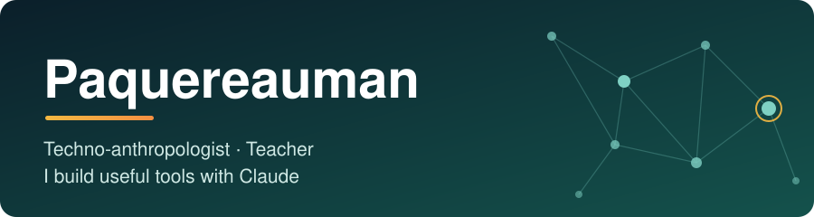

 

---

## 👋 Salut, moi c'est Paquereauman

J'ai une formation en **anthropologie** et je suis aujourd'hui **enseignant**. J'ai appris Python à la base pour faire du **web scraping** : récupérer des données pour mes recherches.

Aujourd'hui, je code surtout **avec Claude**. Ce qui m'intéresse, c'est de partir d'un vrai problème que je vois autour de moi et d'en faire un outil qui sert à quelqu'un.

## 🧭 Ce que j'aime faire

- 🦽 **Des outils pour l'accessibilité** : trouver des solutions pour les personnes à mobilité réduite.
- 🎓 **Des outils pour mon travail** : simplifier ce que je fais en classe et au quotidien.
- 🔎 **Observer avant de construire** : mon regard d'anthropologue m'aide à comprendre ce dont les gens ont réellement besoin.
- 🌱 **Apprendre en faisant** : chaque projet m'apprend quelque chose de nouveau.

## 🛠️ Boîte à outils

## 🚀 Projets

| Projet | Description |
|---|---|
| 🎸 [**Barré guitare**](https://paquereauman.github.io/Paquereauman/barre-guitare/) ([code](./barre-guitare)) | Une appli web pour apprendre le barré : la position de la main, des accords animés qui glissent sur le manche, et des exercices de logique. |

*D'autres projets arrivent. Je les ajoute ici au fur et à mesure.*

## 📫 Me contacter

Une idée, un problème à résoudre, une collaboration ? Écris-moi : **[bpaquereau@hotmail.fr](mailto:bpaquereau@hotmail.fr)**

---

Fait avec curiosité, du café et un peu d'aide de Claude.

