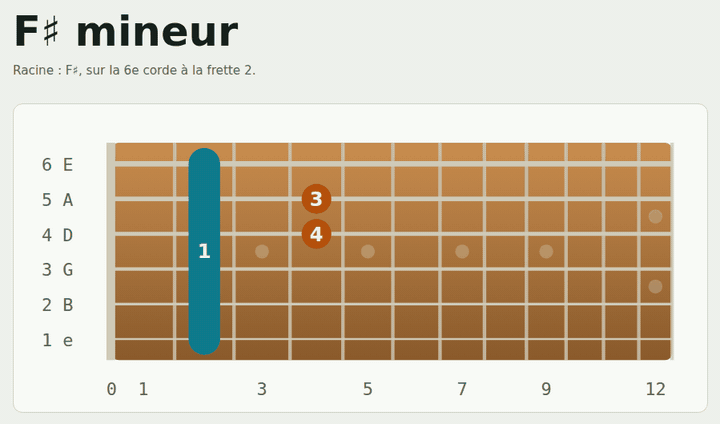

 

<a href="https://paquereauman.github.io/Paquereauman/barre-guitare/">🎸 Live demo</a> ·
<a href="#-projects">🚀 Projects</a> ·
<a href="#-get-in-touch">📫 Contact</a>

---

## 🎸 Featured project: Barré guitare

A web app that teaches **barre chords**, one of the hardest steps for guitar beginners. Chords go from the easiest (the 4-string mini-barre) to the hardest, with hand and palm placement, drills with a timer and two songs to practise. The interface is in French.

**[Open the app →](https://paquereauman.github.io/Paquereauman/barre-guitare/)**

---

## 👋 Hi, I'm Bai Laoshi

I trained in **techno-anthropology** in **Copenhagen**, the study of how people and technology shape each other, and I now work as a **teacher**. I originally learned Python to do **web scraping**: collecting data for my research.

Today I mostly code **with Claude**. What I enjoy is starting from a real problem I see around me and turning it into a tool that helps someone.

## 🧭 What I like to do

- 🦽 **Accessibility tools**: finding solutions for people with reduced mobility.
- 🎓 **Tools for my work**: making what I do in class and day to day simpler.
- 🔎 **Observing before building**: my techno-anthropology training helps me understand what people actually need.
- 🌱 **Learning by doing**: every project teaches me something new.

## 🛠️ Toolbox

## 🚀 Projects

| Project | Description |
|---|---|
| 🎸 [**Barré guitare**](https://paquereauman.github.io/Paquereauman/barre-guitare/) ([code](./barre-guitare)) | A web app to learn barre chords on guitar: hand position, animated chords that slide along the neck, practice drills and logic quizzes. In French. |

*More projects are coming. I add them here as I go.*

## 🔭 Right now

- 🎸 Improving the barré app, with real photos of the hand position.
- 🧪 Looking for the next everyday problem to solve with a tool.

## 📫 Get in touch

Got an idea, a problem to solve, or want to collaborate? Write to me: **[bpaquereau@hotmail.fr](mailto:bpaquereau@hotmail.fr)**

---

Made with curiosity, coffee and a bit of help from Claude.

