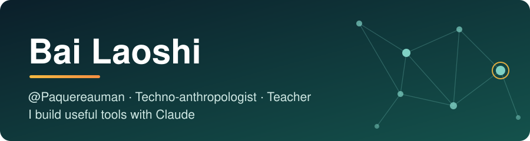
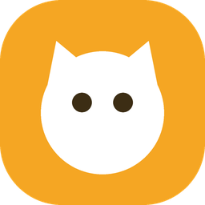
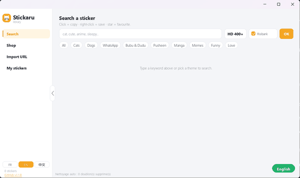



 

<a href="https://paquereauman.github.io/Paquereauman/">🌐 Website</a> ·
<a href="https://github.com/Paquereauman/stickaru/releases/latest">📥 Download Stickaru</a> ·
<a href="#-projects">🚀 Projects</a> ·
<a href="#-get-in-touch">📫 Contact</a>

---

##  Featured project: Stickaru

A **Windows desktop app** that puts a sticker and meme library one click away. Search animated stickers (Tenor, GIPHY), Telegram packs and RisiBank with **no API key**, click any image to copy it, transparency included, straight into WhatsApp, Discord or WeChat, and keep your favourites in your own collection. It is also handy for **slideshows and presentations**: drop a transparent sticker or animated GIF onto a slide in PowerPoint or Google Slides with a simple paste, no cropping or background removal needed. The interface comes in French, English and Chinese.

**[Download the installer →](https://github.com/Paquereauman/stickaru/releases/latest)** · [Source code](https://github.com/Paquereauman/stickaru)

---

## 👋 Hi, I'm Bai Laoshi

I trained in **techno-anthropology** in **Copenhagen**, the study of how people and technology shape each other, and I now work as a **teacher**. I originally learned Python to do **web scraping**: collecting data for my research.

Today I mostly code **with Claude**. What I enjoy is starting from a real problem I see around me and turning it into a tool that helps someone.

## 🧭 What I like to do

- 🦽 **Accessibility tools**: finding solutions for people with reduced mobility.
- 🎓 **Tools for my work**: making what I do in class and day to day simpler.
- 🔎 **Observing before building**: my techno-anthropology training helps me understand what people actually need.
- 🌱 **Learning by doing**: every project teaches me something new.

## 🛠️ Toolbox

## 🚀 Projects

| Project | Description |
|---|---|
|  [**Stickaru**](https://github.com/Paquereauman/stickaru) ([installer](https://github.com/Paquereauman/stickaru/releases/latest)) | A Windows sticker and meme library: keyless search (Tenor, GIPHY, Telegram, RisiBank), one-click copy with transparency, favourites, plus transparent stickers you can paste straight into slideshows. Python and pygame, in French, English and Chinese. |
| 🎸 [**Barré guitare**](https://paquereauman.github.io/Paquereauman/barre-guitare/) ([code](./barre-guitare)) | A web app for guitar: your own song list with chords, YouTube videos attached to each song, and a tuner that listens through the microphone. In French. |
| 🈶 [**Learn Chinese**](https://paquereauman.github.io/apprendre-chinois/) ([code](https://github.com/Paquereauman/apprendre-chinois)) | A Mandarin course from A1 to B1 for French speakers: about 900 words, a tone gym with animated pitch curves, spaced repetition, grammar and character writing. One web page, works on phone and computer. In French. |
| 🎙️ [**Dictaphone DeepSeek FR**](https://github.com/Paquereauman/dictaphone-deepseek-fr) | Free voice dictation in French for DeepSeek: a Chrome extension plus a local Whisper server, so nothing leaves the computer. Voice commands such as "Valider" send the message. |

*More projects are coming. I add them here as I go.*

## 🔭 Right now

- 🎸 Improving the barré app, with real photos of the hand position.
- 🧪 Looking for the next everyday problem to solve with a tool.

## 📫 Get in touch

Got an idea, a problem to solve, or want to collaborate? Write to me: **[bpaquereau@hotmail.fr](mailto:bpaquereau@hotmail.fr)**

---

Made with curiosity, coffee and a bit of help from Claude.

